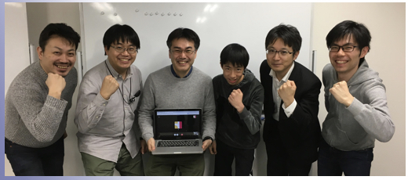

# 私達について

## チーム紹介

Jyo_senは中学生から社会人のメンバー約10名で構成されています。
メンバーの大部分は秋葉原プログラミング教室のAIプログラミングコースに通っていた生徒ですが、プログラミングコースで教わったコードを実行しているだけでは、プログラミングの能力の向上には限界がありました。
そこで、RoboCup2Dシミュレーションに参加するためのサッカー部を作ることによって、プログラミング能力の向上と世代を超えたコミュニケーションを楽しんでいます。

秋葉原プログラミング教室は2020年３月に終了したため、現在はAkihabara Programming Afterschoolというサークルを作成し、RoboCup2Dシミュレーションの研究を続けています。水曜20時からの遠隔ミーティングを中心にオンラインで活動しています。

秋葉原プログラミング教室を主催していた清水亮は新潟県長岡市の出身であることから、Jyo_senというチーム名は長岡藩の藩主である牧野家の家訓である「常在戦場」から取っています。

【RoboCup】C++を始めて4ヶ月でAIサッカー全国大会に挑戦する小学生と素人軍団【2D Sim】
https://wirelesswire.jp/2019/08/71988/

## 実績

Jyo_senは2019年に開かれたJapanOpen2019に初参加し、10チーム中５位の成績でした。

| 大会名称・年度       | 出場者数 | 順位 | 備考   |
| -------------------- | -------- | ---- | ------ |
| JapanOpen2019nagaoka | 10チーム | 5位  | 初参加 |

 

2021年に実施予定のRobocup世界大会の出場資格も得ています。
https://2020.robocup.org/en/home/

## 強化学習を使ったPK戦のキッカーの動きの改善

HFO(Half Field Offense)というプラットフォームを使って、PK戦のキッカーの動きを改善するための強化学習を行いました。強化学習で学んだ動きをJyo_sen2020に移植したところ、シュート角度をつけることによってキーパーのいない場所にシュートを打てるようになりましたが、シュートを打つ準備をしているときにキーパーに追いつかれてしまうという課題も発生しました。そのような課題を解決することによって、キッカーの得点力をさらに高めるように改善していく予定です。

Half Field Offense: An Environment for Multiagent Learning and Ad Hoc Teamwork
http://www.cs.utexas.edu/~AustinVilla/sim/halffieldoffense/

## 最後に
質問等はこちらまでお願いします。活動の見学、活動に参加したい方、ご連絡お待ちしております！
https://forms.gle/3f4YoHGC8bgsH4dU7